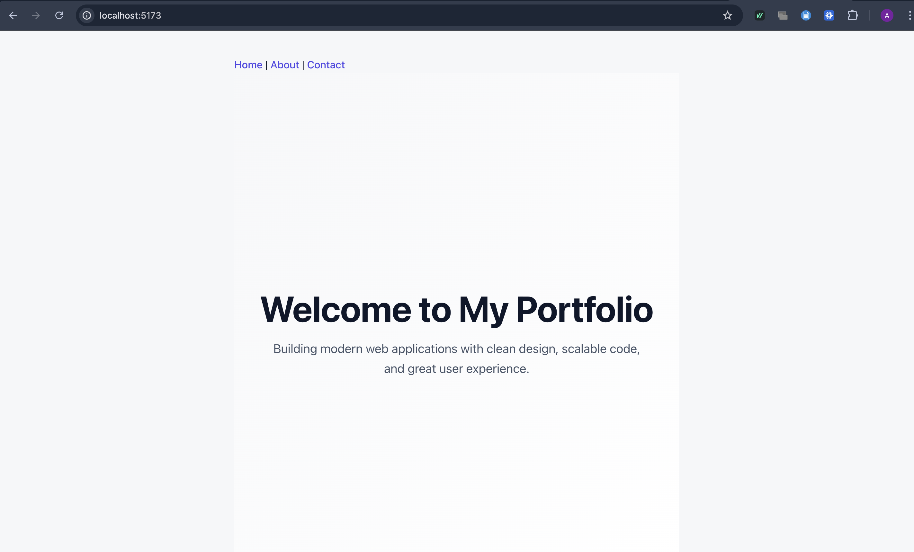
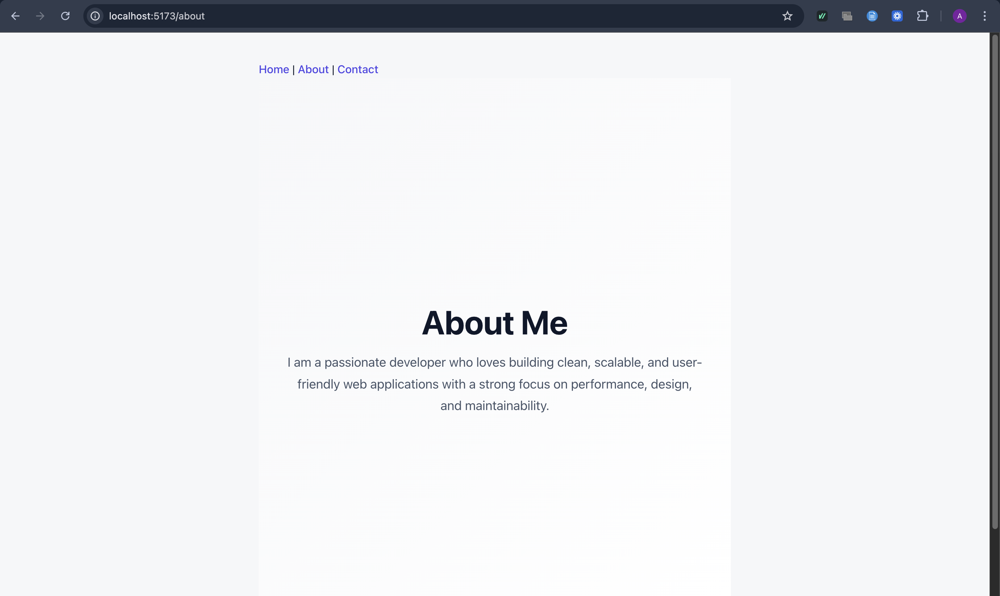
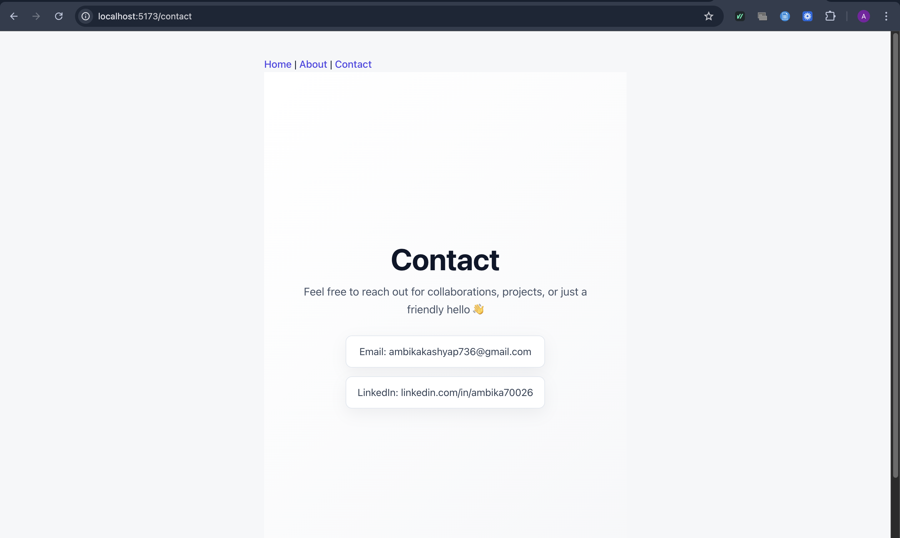

Experiment – 3 (SPA Routing)

Aim

To create a basic Single Page Application (SPA) using React and implement client-side routing using React Router DOM.

------------------------------------------------------------------

Introduction

A Single Page Application (SPA) is a web application that loads only one HTML page and dynamically updates its content without refreshing the entire page.
This experiment demonstrates how React enables SPA behavior and how React Router DOM is used to navigate between multiple views such as Home, About, and Contact without reloading the browser.

A SPA mainly works using the following three layers:

1. Frontend (Client Side)

Browser loads index.html only once

JavaScript takes control of routing and rendering

Navigation happens using client-side routing

No page reload occurs on route change

2. Static Server (Frontend Server)

Serves static files such as HTML, CSS, and JavaScript

Does not generate dynamic pages

3. Backend Server (API Server)

Frontend communicates with backend using:

fetch()

axios

Data is exchanged in JSON format

--------------------------------------------------------

SPA Working Flow

User opens the website URL

Browser requests index.html

Static server sends HTML, CSS, and JavaScript files

SPA loads in the browser

User clicks on a navigation link (Home → About)

React Router updates the URL

Required component is rendered dynamically

No server request is made for a new page

Frontend sends API request to backend (if required)

Backend processes request and fetches data from database

Backend returns JSON response

UI updates dynamically without page reload

----------------------------------------------------------------

Learning Outcomes

Understood the role of the frontend in rendering user interfaces dynamically in a Single Page Application

Learned how client-side routing works using React Router DOM without page reloads

Gained knowledge of frontend–backend communication using API calls

Understood the difference between static frontend resources and dynamic backend data

Developed practical understanding of building a responsive and interactive SPA using modern frontend technologies