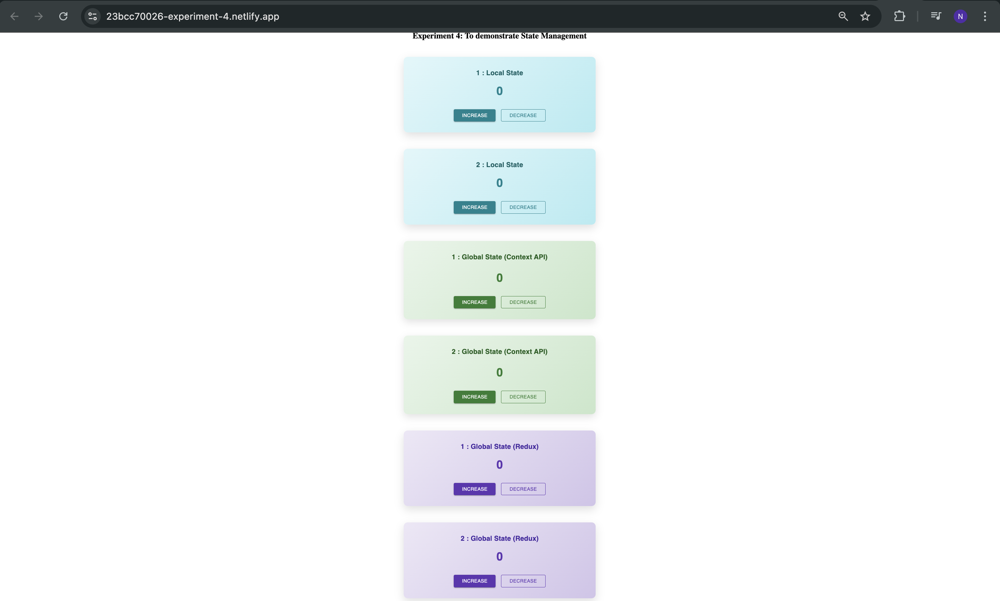

Experiment No.: 4

Aim

To implement state management in a React application using Redux and Context API for efficient handling of global application state.
 
 -------------------------------------------------------------------------------------------------

Objectives

To understand the concept of state management in React applications.

To implement global state management using React Context API.

To implement centralized state management using Redux.

To compare the working of local state, Context API, and Redux.

To develop reusable components that consume global state.

To manage data flow between multiple components effectively.

--------------------------------------------------------------------------------------------------

Learning Outcomes

After completing this experiment, the learner will be able to:

Understand the need for state management in large-scale React applications.

Implement and use React Context API for global state handling.

Implement Redux store, reducers, and actions for managing application state.

Pass and manage data across multiple components without prop drilling.

Differentiate between local state, Context API, and Redux approaches.

Build scalable and maintainable React applications using proper state management techniques.

# Screenshots:
